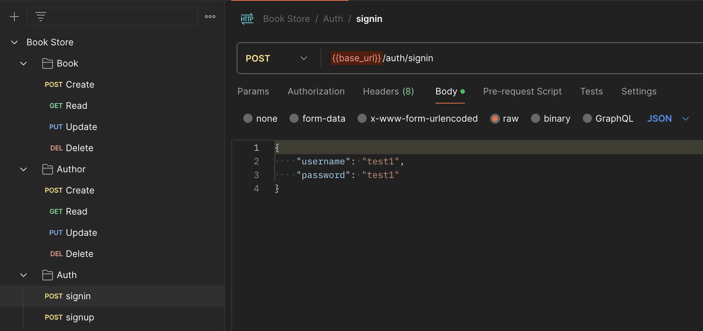

# Book Store API




Feel free to import the [Postman collection](https://github.com/humaid0x/Book-Store-API/blob/main/postman/Book_Store.postman_collection.json) into your Postman workspace to explore and test the API endpoints.

# ⚡️ Run Instructions

1. **Clone the repository:**

    ```bash
    $ git clone git@github.com:humaid0x/Book-Store-API.git
    ```

2. **CD into the project directory:**

    ```bash
    $ cd Book-Store-API
    ```

3. **Download module dependencies:**

    ```bash
    $ go mod download
    ```

4. **Modify `app.env` contents as needed.**

5. **Run the application:**

    ```bash
    $ go run main.go
    ```


## Book Routes

### Create a Book

- **Endpoint:** `POST /books/`
- **Body:** `{"authorID": 1, "bookName": "Sample Book", "description": "Lorem ipsum dolor sit amet"}`

### Read Books

- **Endpoint:** `GET /books/`

### Update a Book

- **Endpoint:** `PUT /books/{bookID}`
- **Body:** `{"authorID": 2, "bookName": "Updated Book"}`

### Delete a Book

- **Endpoint:** `DELETE /books/{bookID}`


## Author Routes

### Create an Author

- **Endpoint:** `POST /authors/`
- **Body:** `{"name": "John Doe", "address": "123 Main St"}`

### Read Authors

- **Endpoint:** `GET /authors/`

### Update an Author

- **Endpoint:** `PUT /authors/{authorID}`
- **Body:** `{"name": "Updated Author", "address": "456 Oak St"}`

### Delete an Author

- **Endpoint:** `DELETE /authors/{authorID}`

## Auth Routes

### Sign In

- **Endpoint:** `POST /auth/signin`
- **Body:** `{"username": "demo_user", "password": "demo_password"}`

### Sign Up

- **Endpoint:** `POST /auth/signup`
- **Body:** `{"email": "demo@example.com", "username": "demo_user", "password": "demo_password"}`
